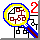

 

CRI-MAP Tutorial - Mapping & LOD scores
---------------------------------------

------------------------------------------------------------------------

Other **CRI-MAP tutorial** contents:

 

[Manuals:\
Web & text\
versions](crimanua.html)

[Web Manual\
Table of\
Contents](manuatoc.html)

[ Tutorial \
 Practice \
 Datasets ](datasets.html)

[Formating\
data with\
\"`prepare`\"](datafrmt.html)

[Testing &\
Extending\
Maps](analyse2.html)

[Bibliography\
&\
Other Links](biblinks.html)

------------------------------------------------------------------------

4. [Building a map](#build)  (`build` option) 
:   [Ex. 4.1](#ex4.1) - choosing loci; editing the `.par` file
:   [Ex. 4.2](#ex4.2) - haplotying loci; choosing loci via `twopoint`
:   [Ex. 4.3](#ex4.3) - checking the map with `flipsn`

5. [Extending a map](#instant) (Using the `chr2.ord` file) 
:   [Ex. 5.1](#ex5.1) - choosing and adding more loci via
    `twopoint & instant`
:   [Ex. 5.2](#ex5.2) - more `build` runs; more `flipsn`

[]{#build}

------------------------------------------------------------------------

### 4. Building a map

The `build` option evaluates the likelihood of possible maps (also
called \"locus orders\") using the most informative data first. Loci are
added in their order of informativeness, i.e., in their ranking of
number of informative meioses. Further, the addition of loci is a two
step process. In the first step, the more efficient data from phase
known meioses are used to evaluate possible maps; in the second, phase
unknown information is used.\
Ideally, `build` stops when it has found the best of all possible maps
incorporating all the loci. Practically, *all* possible maps cannot be
evaluated; the memory requirements can be too great. For this reason, as
`build` moves on to add the next locus, it discards those maps with
likelihoods much lower than the current \"best\" map, and retains only
at most a limited number of possible maps. These practical limitations
can lead to incomplete or even incorrect maps; the map discarded part
way through a `build` run due to lack of support from the loci already
processed may be the correct one, when all loci are considered.
Fortuantely, these parametres - how *much* lower in likelihood and
maximum possible map number - may be changed. The best mapping strategy
is to run `build` several times, **BOTH** altering these parametres
until the programme takes too long to run **AND** changing the order in
which the loci are processed. These two parametres (and others), as well
as the order of locus processing, are defined in the `chr#.par` file.

[A typical]{#conceptex} `build` run, adding loci `D` and `E` to an
existing map of three loci, \"`A  B  C`\", might proceed [like
this](typicalb.html):

To illustrate refined use of the mapping and map testing features of
**CRI-MAP**, we need a more complex data set; please retreive
[chr2gen.zip](datasets/chr2/chr2gen.zip) to your `Crimaptutl` directory,
\"unzip\" it, and run the `prepare` option on it for a subsequent
`build` run. Respond to the `prepare` option prompts as before. *(Don\'t
know how to \"unzip\" a file? Check the [\"zip\"](unixcmds.html#zip)
command on the [UNIX Commands Short List](unixcmds.html) page.)*

[`chr2.gen`]{#chr2data} is a large file (\~292 K), holding data for 65
families scored for up to 78 co-dominant (e.g., RFLP)
loci[\*](#locidefn). The `prepare` option has determined the
informativeness of these loci ([chr2.loc](datasets/chr2/chr2loc.html))
and ranked them as well ([chr2.par](datasets/chr2/chr2par.html)). The
two most informative (`68 (D2S44) & 7 (CEB1/HINF)`) show as the ordered
loci, and the other 76 show as the loci to be inserted, least
informative (`8 (CEB11/HINF), 46 (D2S65), & 60 (D2S12)`) last.

[]{#save}To save both our time and our eyes, we will `build` maps using
*only a subset* of these 78 loci! In the following `build` exercise,
there are four steps:

1.  starting with [cytological evidence](datasets/chr2/chr2locr.html),
    choose meiotically informative loci that are also precisely located
    within the *p* arm (i.e., choose those assigned to one or only a few
    bands), and use these as the `ordered_loci`;
2.  selecting six to ten other loci, also informative and also located
    on *p*, and use these as the `inserted_loci`;
3.  edit the `chr2.par` file to effect these choices, and run the
    `build` option with the default parametres; &
4.  alter a few of these parametres, re-run `build`, and check the
    effects.

 
:   ***Exercise** CRI-MAP [4.1]{#ex4.1}: build a map - choosing loci and
    editting the* `.par` *file*
:   Examine the [cytological evidence](datasets/chr2/chr2locr.html) to
    determine which of the 30 loci found on the p *arm are candidates
    for* `ordered_loci`*. Choose loci having high meiotic
    informativeness and/or precise chromosome band assignment. Next
    choose six to ten others as the* `inserted_loci`*. When finished,
    [see if you agree with any of my
    choices](datasets/chr2/choices.html).*

    Edit the file `chr2.par` *so the* `ordered_loci` *field specifies
    the index numbers of two informative loci (or three, in their
    correct order!), with some of the other* p *arm loci as*
    `inserted_loci`*. Save this file twice: as* `chr2.par` *and
    backed-up as* `chr201.par`* . Also back-up* `chr2.ord` *as*
    `chr2.ord.orig`* . (If you want to use sets of ordered and inserted
    loci that differ from the [tutorial
    choices](datasets/chr2/choices.html#trys), please create **extra***
    `chr2try#.par` *files matching them.) []{#build201}*

    Enter the command `crimap 2 build > build201.out` *at the prompt.
    When finished, the prompt will return, and you may browse the
    programmes\' output with the command* `more build201.out`* . (To*
    `build` *maps from other sets of ordered and inserted loci, first
    rename the* `chr2try#.par` *file to* `chr2.par`*. Next back-up*
    `chr2.ord` *to* `chr201.ord`* , and restore the original* `chr2.ord`
    from `chr2.ord.orig`* . Finally, re-issue the*
    `crimap 2 build > build2##.out` *command, naming the output file for
    the try\#.)*

A quick glance through [`build201.out`](datasets/chr2/build201.html)
shows the structure of the programmes\' output. After a re-statement of
much of the `chr2.par` file, the loci used to build the map are listed
and described as ordered or inserted. Then a series of interim reports
reveals the status of the currently ordered loci (\"`current orders`\")
plus which other locus the programme is presently trying to insert into
those current orders (the *extra* locus shown in \"`orders_temp`\").
Finally, and unfortunately for this `build` run, the programme exits
with no loci added to the \"`current orders`\", and prints the possible
maps. None of the loci to be inserted were unambiguously placed on the
map of the two original ordered loci; we see the `Sex_averaged map`
having only the two original loci, and mapping them at 100 centi-Morgans
apart. This is followed by the most likely placements for each of the
inserted loci.

The three other trial sets of ordered and inserted loci also fail to
produce maps of the *p* arm. How, then, does one choose the ordered and
inserted loci? As I mentioned, these naïve choices assumed the dataset
has mapping information for each locus relative to all others. (They
also assumed we would be lucky enough to choose loci less than 100 cM
apart!) To find which loci ARE mappable with which other loci, we must
use **CRI-MAPs** [`twopoint` option](wwwversn.html#RTFToC45). At the
same time, and to maximise the available information, we will use
\"locus haplotyping\" for loci with multiple polymorphisms.

 
:    ***Exercise**
    CRI-MAP [4.2]{#ex4.2}: build a map - haplotyping loci in*
    `prepare`*;\
     choosing loci
    via* `twopoint`
:   Re-run the `prepare` *option on* `chr2.gen`*. This should overwrite
    the* `chr2.ord` *file. When asked*

    `Do you wish to change any of these values? (y/n)`

    enter \"y\", **if** `use_haps = 0` *and set it to* `1`* ! Then when
    asked*

    `Do you wish to enter any new haplotyped systems? (y/n)`

    enter \"y\". There are nine genes each scored two or more times, for
    two or more independent polymorphisms (unique probe-enzyme
    combinations). For each of these genes, enter its polymorphisms in a
    haplotyped system, having \"inter-locus\" distances of zero.

        hap_sys0 0 2 4 *
        hap_sys0 1 3 *
        hap_sys0 23 24 *
        hap_sys0 39 40 *
        hap_sys0 41 42 *
        hap_sys0 44 45 *
        hap_sys0 53 54 *
        hap_sys0 63 64 *
        hap_sys0 72 73 75 76 *
        done

    *Choose the* `twopoint` *option, respond with \"n\" when asked if
    you want LOD tables for ALL pairs of loci, and enter the index
    numbers of the* p *arm loci as ordered loci.*

        1 5 9 33 39 41 44 50 53 55 56 59 60 62 63 65 66 67 68 69 70 71 72 *

    *Enter no inserted loci. This will force the calculation of pairwise
    lodscores for all pairs of loci on the* p *arm. After accepting the
    new parametre file, type* `crimap 2 twopoint > 2p2ptlod.out`.
    []{#2p2pt}

    *Browse the* [`2p2ptlod.out`](datasets/chr2/2p2ptlod.html) *file.
    After a re-statement of the parametres, and a listing of the
    haplotyped systems, this file lists pairs of loci that are
    genetically linked, plus their likely recombination fractions and
    the confidence placed in these estimates (*`lods`*). While any pair
    of loci in this list could be chosen as* `ordered_loci` *for the
    next* `build` *run, choose a pair with both a large inter-locus
    distance (*`rec. fracs.`*) and confidence (*`lods`*). By these
    criteria, good choices are locus pairs* `D2S43 - D2S44` *or*
    `D2S6 - D2S48`.

Choosing loci that are far apart for the inital map has the advantage
that the `build` run may \"reach\" more distant loci on either side of
the map. However, there may be more errors in the relative positions of
loci mapped both between the two inital loci and on either side. For
this reason, such `build` runs are best followed by `flipsn` runs. Most
likely maps from these trials can then be used as ordered loci for
subsequent `build` runs, with all remaining loci to be inserted.\
Of course, ordered loci may be chosen on other criteria. Another fine
choice is the set of three loci reported in the first three twopoint
scores: `D2S1, ACP1, & TPO`. Though the interlocus distances are small,
the dataset maps them with high confidence, and their most probable
order (`ACP1 - D2S1 - TPO`) seems clear.\
The best strategy, as mentioned previously, is to choose a number of
different sets of ordered and inserted loci, `build`ing a map with each
one, and proceding with the most successful map(s). For a third set of
ordered and inserted loci, use the three loci of the second trio of
twopoint scores: `APOB, D2S70, & D2S48`. Their most probable order is
`D2S48 - APOB - D2S70`

 
:   ***Exercise** CRI-MAP [4.3]{#ex4.3}: build a map - re-edit*
    `chr2.par`*; re-run* `build`*;\
     check the map
    with* `flips`n
:   Copy and edit `chr2.par` *to reflect each of your sets of choices
    for* `ordered_loci & inserted_loci`*, saving back-ups as*
    `chr211.par`* ,* `chr212.par`* , etc. Re-run the* `build` *option
    for each set of locus choices, re-directing the programmes output to
    unused filenames (e.g.,* `build211.out, build212.out, etc.`*).
    Don\'t forget to back-up the* `chr2.ord` *file after each run, and
    restore the original version before the next* `build`*! Browse the
    output files to see which final set of ordered loci - which map - is
    biggest. Note that \"biggest\" may mean largest number of loci
    mapped, or largest span of centi-Morgans covered, depending on your
    goals.*

    Create another copy of `chr2.par` *and place the loci of the biggest
    map -* in their reported order *- in the* `ordered_loci` *field,
    leaving the* `inserted_loci` *blank. Finally, put this map through a
    local rearrangement analysis with the* `flips4` *option. Re-direct
    the programme output to* `flip42##.out`.

[]{#choices2}

Of the [three sets](datasets/chr2/choices2.html) of ordered and inserted
loci suggested, the third set gives the biggest map. However, there is
useful information in the results from each of these `build` runs,
information that can help us to construct a still better interim map.
Examining each of these `build2##.out` files \...

-   **Try 11**\
    map beginning with: `D2S44 D2S43`\
    extended by three loci: `D2S45, (D2S54+D2S54_2), & D2S62`\
    now covers: 41.9 cM\
    MAP:  `D2S44 (D2S54+D2S54_2) D2S43 D2S62 D2S45`
-   **Try 12**\
    map beginning with: `ACP1 D2S1 TPO`\
    extended by one locus: `D2S47`\
    still covers: 8.1 cM\
    MAP:  `ACP1 (D2S1+D2S1_2) D2S47 (TPO+TPO_2)`
-   **Try 13**\
    map beginning with: `D2S48 APOB D2S70`\
    extended by nine loci:
    `(D2S5+D2S5_2), D2S6, D2S43, D2S44, D2S45, D2S47, D2S51, (D2S54+D2S54_2), & D2S62`\
    now covers: 187.2 cM\
    MAP:  `D2S51 D2S44 (D2S54+D2S54_2) D2S43 D2S62 D2S45 (D2S5+D2S5_2) D2S6 D2S48 (APOB+APOB_2) D2S70 D2S47`

Notice that the map from **Try 11** is contained by the map from **Try
13**. Notice further that both **Try 12** and **Try 13** manage to
insert locus `D2S47`, yet have no other loci in common. Although all
`build` runs had access to the same mapping data, and were attempting to
map the same set of 23 *p* arm loci, strikingly different maps were
produced. The \"take-home message\" is *try MANY build runs!*\
A difference in the order in which loci were added to the
`current_orders` gave the difference in map resolving power between
**Try 11** and **Try 13** `build` runs. But why did **Try 13** fail to
include the ordered loci of **Try 12**? This seems especially odd
because `D2S47` - the common locus - was added to the **Try 13** map
BEFORE any of `ACP1 D2S1 & TPO` were tried. One problem could be that we
have specified the least informative locus for two of the three
haplotyped sets of loci in this critical region. In the [programme
authors\' language](wwwversn.html#parhap_sys), we are using weak loci as
\"primary loci\", which may use the extant data less efficiently. Using
the most informative haplotyped loci as \"primaries\" yields
`chr214.par` with the following changes:

    ...
    ordered_loci 56 54 50  *
    inserted_loci 68 69 65 44 64 5 67 1 66 33 59 62 70 75 55 9 42 40 71 60 *

    hap_sys0 75 73 72 76 *
    hap_sys0 64 63 *
    hap_sys0 54 53 *
    hap_sys0 44 45 *
    hap_sys0 42 41 *
    hap_sys0 40 39 *
    hap_sys0 24 23 *
    hap_sys0 1 3 *
    hap_sys0 0 2 4 *
    END

However, these changes don\'t alter the resultant map. `build214.out`
shows the most likely placements of `ACP1, D2S1_2 & TPO` on its map,
followed by their LOD scores.

    ACP1
        55  68  1   69  33  59  40  66  56  54  50  65  
                                                  X   X 

    -627.11
    -626.89

    D2S1_2
        55  68  1   69  33  59  40  66  56  54  50  65  
                                                  X   X 

    -614.28
    -614.06

    TPO
        55  68  1   69  33  59  40  66  56  54  50  65  
                                                  X   X 

    -645.62
    -645.82

Accurate placement of these loci might require waiting for this end of
the map to be \"filled in\" with at least one other locus showing
linkage to them. []{#flips}

Using the `hap_sys0` revisions of `chr214.par` ,
[`flip4215.out`](datasets/chr2/flip4215.html#close) reveals only one
local rearrangement - a switch of two neighbouring loci - with a
likelihood close to the best current map. With a LOD score 1.46 worse,
this rearrangement is \~28.8 fold LESS likely than the best map. All
other rearrangements have LOD scores 3.000 or more worse, and are
filtered out of the `flip4215.out` report. This gives us high confidence
in *most* of the map, and an additional reason to focus on adding new
loci to its right end; not only might we place `ACP1, TPO, & D2S1`, but
also we could settle on the true order for
\"`D2S48 (APOB+APOB_2) D2S70 D2S47`\" . So, what new loci might be
insertable, and what is their best sequence in the `inserted_loci`
parametre for efficient and effective use of the next `build` run?

[]{#instant}

------------------------------------------------------------------------

### 5. Extending a map

There are three sources of new loci: 1.) those known to be on the *p*
arm but not yet located on the map (i.e., 11 loci already tried), 2.)
those possibly on the *p* arm (i.e., 34 untried loci having no
cytological location data), & 3.) those known to be on the *q* arm
(i.e., 14 untried loci). While several of these new loci will show no
linkage to the current map, when extending a map, it is acceptable to
reduce the stringency used to reject other locus orders and reports of
recombination fraction. We have used a stringency of LOD \>=3.000 (the
parametres `PK_LIKE_TOL & PUK_LIKE_TOL`); reducing these to 2.000 could
help \"filling-in\" the extant map in another `build` run. However, to
run `build` with a set of 12 `ordered_loci` against a set of 11 + 34 +
14 `inserted_loci` would take a VERY long time, and the result could be
disappointing or brilliant, depending on the order in which the loci
were tried. A better idea - to screen out loci distant from the current
map and to omit loci with no information - is to first try the
`twopoint` option again, looking for significant linkage between loci on
the current map and loci we hope to insert. Then, having chosen the
subset of loci to be inserted, determine the best sequence in which to
insert them, using the information stored in `chr214.ord` and the
`instant` option.

 
:   ***Exercise** CRI-MAP [5.1]{#ex5.1}: extend a map - selecting new
    loci with* `twopoint`*;\
     choosing the
    insertion order for these loci with* `instant`
:   Create `chr216.par` *with* `PK_LIKE_TOL & PUK_LIKE_TOL` *set to
    2.000,* `ordered_loci` *as the current map, and* `inserted_loci` *as
    the balance of the* p *arm loci, plus those of* q *or unknown
    cyto-location (see the [cytological
    evidence](datasets/chr2/chr2locr.html) again, and remember to omit
    secondary loci in haplotyped systems). [Check your
    choices](datasets/chr2/chr216.html). Copy* `chr216.par` *to*
    `chr2.par`*.*
:   Save the output of \"`crimap 2 twopoint`*\" as
    [2pt216.out](datasets/chr2/2pt216.html), and note the subset of
    inserted loci that shows linkage to those loci in the current map.
    (Spot these loci quickly as the second one in each pair.)*

Of the several new loci screened for linkage to those in the current map
of the *p* arm, 32 show a significant score at LOD 2.0 or better. Oddly,
since we are working with the *p* arm, two loci cytologically placed on
*p* and with high informativeness have been excluded from these 32:
`D2S61_2 (64) & CPSI (9)`. Perhaps more oddly, four of these 32 loci
have been cytologically located to the *q* arm:
`LCT (49), GYPC (58), D2S17 (35), & D2S16 (34)`. If one or more of these
can be inserted in the current map, we could have a starting point for
extending our map across all of chromosome 2. (*Don\'t worry - not part
of the tutorial!*)

 
:   *Create* `chr217.par` *with* `PK_LIKE_TOL &PUK_LIKE_TOL` *set to
    2.000,* `use_ord_file` *set to 1,* `ordered_loci` *as the current
    map, and* `inserted_loci` *as the newly chosen subset. [Check your
    choices](datasets/chr2/chr217.html). (Note that the locus sequence
    for the* `inserted_loci` *parametre is NOT important at this stage;
    I simply added the loci in their order of occurence in
    [2pt216.out](datasets/chr2/2pt216.html).) Copy* `chr217.par` *to*
    `chr2.par`*, and copy* `chr214.ord` *to* `chr2.ord`*.*
:   Save the output of \"`crimap 2 instant`*\" as
    [inst217.out](datasets/chr2/inst217.html)*

[]{#explain}

The `inst217.out` file requires some explanation. Its form is very much
like any of the `build2**.out` files; it re-states the parametres used
and lists the loci, follows with the current map, including interlocus
distances and overall LOD score, and finishes with \"most likely\"
locations for the unmapped loci. For the loci attempted in the previous
`build`, \"most likely\" locations are estimated using both LOD scores
AND the locus orders database, stored in `chr2.ord`. For new loci, only
LOD scores may be employed. Thus, the \"most likely\" locations for the
first previously tried locus in the list,
[`TGFA_3`](datasets/chr2/inst217-2.html#tgfa_3), are on either side of
locus `59`, with equally likely LOD scores of `-620.34` . The \"most
likely\" locations of the first new locus,
[`D2S25`](datasets/chr2/inst217-2.html#d2s25), are shown as being in
each of the thirteen possible insertion locations, but quick inspection
of the LOD scores reveals that this locus is really only likely on
either side of locus `33` .

 
:   *Now, using these \"most likely\" map positions and moving from left
    to right, choose the sequence of loci for the* `inserted_loci`
    *parametre to be used in the next* `build` *runs. For loci having
    two or more equally likely positions, choose the rightmost. When two
    or more loci have the same \"most likely\" location, insert the loci
    having the highest LOD scores first. The final list will consist of
    13 groups corresponding to the 13 possible insertion locations, each
    group having one or more loci, ranked internally by LOD scores.
    [Check your choices](datasets/chr2/chr218.html), and create*
    `chr218.par` .

Now for the second round of `build` runs.

 
:   ***Exercise** CRI-MAP [5.2]{#ex5.2}: extend a map - inserting the
    new loci via* `build`*, using a variety of insertion sequences for
    these loci*
:   Improve the current map by trying two or three new `build` *runs
    using the subset of loci discovered above. (Don\'t forget to back-up
    the* `chr2.ord` *file after each run, and to restore an original
    version before the next* `build`*!)*
:   In addition to `chr218.par` *from above, create* `chr219.par` *with*
    `PK_LIKE_TOL & PUK_LIKE_TOL` *set to 2.000,* `use_ord_file` *set to
    1,* `ordered_loci` *as the current map, and the* `inserted_loci` *in
    sequence of their informativeness (recall this is **CRI-MAP**s
    default choice). Lastly, create* `chr220.par` *with the entire
    current map in reverse order, and* `inserted_loci` *similarly
    switched around (i.e., use \"most likely\" map positions and move
    from right to left.) **NB:** You must set* `use_ord_file` *back to 0
    in* `chr220.par`*!*

    -   **Try 218:** enter loci in the `inserted_loci` *parametre as
        described above, using both \"most likely\" position and LOD
        score criteria. Copy* `chr214.ord` *to* `chr2.ord`*.
        (*`chr218.par` *&* `build218.out` *\[**NB:** \> 110K!\]);*
    -   **Try 219:** enter loci in the `inserted_loci` *parametre in
        strict order of informativeness. Copy* `chr214.ord` *to*
        `chr2.ord`*. (*`chr219.par` *&* `build219.out` *\[**NB:** \>
        110K!\]);*
    -   **Try 220:** reverse the order of the `ordered_loci` *used in
        Try 218, and reverse the order of the 13 locus groups (but NOT
        their internal ranking) for the* `inserted_loci`*. Copy*
        `chr2.ord.orig` *to* `chr2.ord`*. (*`chr220.par` *&*
        `build220.out` \[**NB:** \> 200K!\])

    (NB: These `build` *runs are LONG, requiring lots of memory, and
    the* `build*.out` *files are LARGE; be sure you want to wait for
    them to come!).*

    Run `flips`**2** *on the biggest map.*

These final attempts at map building yield significantly different
results. **Try 218** produces a map of 26 loci, **Try 219** builds a
longer map of only 24 loci, losing six loci from the **218** map but
adding four different ones, and **Try 220** links 27 loci, combining
pieces of the two previous maps & showing two locus pair reversals. The
details of the differences are summarised in the [tables
below](#trystable), but the important conclusion for **CRI-MAP** users
is to process the data in as many ways as possible.\
**Try 219** represents the standard approach, with `inserted_loci` added
in the sequence of their informativeness. **Try 218** was an attempt to
insert the problematic *p* arm loci (those still unmapped after **Try
214**) only after first inserting any other new loci. The attempt
failed, perhaps because the cumulative multipoint linkage evidence was
conflicting. However, inserting loci in a sequence that follows more
closely their likely places in the current map (**Try 218** & **Try
220**) introduces changes to the default map. The new maps both have
more loci, and one is slightly longer. Finally, note that the simple
trick of reversing locus order in both `inserted_loci` and
`current_loci` (**Try 220**) *does* lead to insertion of the problematic
*p* arm loci, and also gives the \"best\" map of the three `build`
runs.\
[]{#trystable}

  build ID   \# loci mapped   ID of loci added                              map length (cM)   LOD score   comments
  ---------- ---------------- --------------------------------------------- ----------------- ----------- ---------------------------------------------------------------------------
  Try 218    26               22 21 13 77 58 49 20 10 24 26 28 31 17 70     220.8             -929.87     LOD=2.000; inserted by \"most likely\" loc\'n & by inf. rank
  Try 219    24               22 61 49 20 10 24 26 28 31 44 42 5            221.7             -902.96     LOD=2.000; inserted by inf. rank
  Try 220    27               21 61 77 49 20 10 24 26 28 31 17 70 44 42 5   232.9             -1033.71    LOD=2.000; inserted by \"most likely\" loc\'n (Try 218 sequence reversed)

  : **Details of the final build runs**

  ----------------------------------------------------------------------------------------
  `      55    68 1             69    33    59       40    66       56 54 50    65     `
  `22 21 55 13 68 1 77 58 49 20 69 10 33 24 59 26 28 40 31 66 17 70 56 54 50    65`
  `22    55 61 68 1       49 20 69 10 33 24 59 26 28 40 31 66       56 54 50 44 65 42 5`
  `   21 55 61 68 77 1    49 20 69 10 33 24 59 26 28 40 31 66 17 56 70 54 50 44 65 42 5`
  ----------------------------------------------------------------------------------------

  : **Maps of the final build runs** (initial `ordered_loci` in first
  row)

[]{#postable}

Running the `flips2` option on the map produced in **Try 220** shows
that this map *isn\'t* the best one!
[`flip2221.out`](datasets/chr2/flip2221.html#maps) lists **one locus
pair** that, when reversed, increases the overall LOD score of the map
(i.e., the LOD score relative to the accepted map is *negative*). This
locus pair, `56 70`, increasing the LOD score by `1.27`, is also one of
the two locus pairs that differed between the maps of **Try 218** and
**Try 220**. Reversing this pair will increase the overall LOD score of
the map from -1033.71 to -1032.44. While this is not a statistically
significant reduction, it may have an effect on the relative LOD scores
of nearby locus pair reversals.
 A check on this -
running [`fixed`](wwwversn.html#RTFToC38) on the [revised
map](datasets/chr2/chr222.html) - confirms the [improvement in LOD
score](datasets/chr2/fixed222.html#improvement). `flips2` on the revised
map reveals no other significantly better rearrangements, though a good
[number of pair reversals](datasets/chr2/flip2222.html#pairrev) are
**within a LOD score of 3.000** of this best map.

------------------------------------------------------------------------

Please continue with the `all & chrompic` options, in\
[**Part 3** - *Testing & X-overs*   ](analyse2.html)

[]{#locidefn}

------------------------------------------------------------------------

 **\*** I use the term a *locus*
here to mean a polymorphism at a locus, detectable via a unique
restriction endonuclease plus probe combination. Thus, a gene with two
(or more) polymorphisms detected by different methods will count as two
(or more) *loci*.

------------------------------------------------------------------------

------------------------------------------------------------------------

[**Comments? Questions? Accolades?**]{#comments}\
*Please* talk to your teacher   **( )**

------------------------------------------------------------------------

Updated on Wednesday, 22 January, 2005\
Copyright
