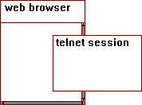

CRI-MAP - Introduction
======================

------------------------------------------------------------------------

**CRI-MAP tutorial** contents:

 

[Manuals:\
Web & text\
versions](crimanua.html)

[Web Manual\
Table of\
Contents](manuatoc.html)

[ Tutorial \
 Practice \
 Datasets ](datasets.html)

[Formating\
data with\
\"`prepare`\"](datafrmt.html)

[Mapping\
with\
\"`build`\"](analyse1.html)

[Testing &\
Extending\
Maps](analyse2.html)

[Bibliography\
&\
Other Links](biblinks.html)

------------------------------------------------------------------------

**CRI-MAP** is a programme for the construction of geneticmaps from gene
linkage data. From the[**CRI-MAP** Manual](crimanua.html)introduction by
its author, Dr. Phil Green \...

    "The main purpose of CRI-MAP is to allow rapid, largely automatedconstruction of multilocus linkage maps (and to facilitate the attendanttasks of assessing support relative to alternative locus orders,generating LOD tables, and detecting data errors). Although originallydesigned to handle codominant loci (e.g. RFLPs) scored on pedigrees"without missing individuals", such as CEPH or nuclear families, it cannow (with some caveats described below) be used on general pedigrees,and some disease loci."

In addition to its primary mapping function, **CRI-MAP** can
alsoestimate recombination fractions & LOD scores between pairs of
loci,perform multipoint likelihood calculations, and point out
recombinantchromosomes in pedigrees.

------------------------------------------------------------------------

This tutorial is divided into three parts:\

1.  [data input & formatting](datafrmt.html)
2.  [mapping & LOD scores](analyse1.html)
3.  [map testing & X-overs](analyse2.html)

Throughout, you will find links to:

-   [the **CRI-MAP**manual (World Wide Web version)](wwwversn.html),
-   [its Table of Contents](manuatoc.html),
-   [and other references](biblinks.html).

For those of you without data, please get some from the

-   [example datasets page](datasets.html).

------------------------------------------------------------------------

**NB:**
:   This is an [INTERACTIVE]{.underline} tutorial; you will benefit
    mostby FOLLOWING the instructions, through READING the examples,
    andDOING the exercises! Exercises are indicated by italics in
    nestedparagraphs \...\

For the majority of the exercises, you need to run an interactive login
session on the Terminal.\
Move this window to the right of your screen, so it \"fits\" between the
up and down scroll bar arrows of your web browser, like this.\

------------------------------------------------------------------------

Now you are ready for\
[**Part 1** - *data input &formatting*  ](datafrmt.html)

------------------------------------------------------------------------

Good luck, Bonne chance, Held og lykke, vielGlück, Succes, \...;

\

Have some fun doing this tutorial, and *PLEASE* send your[comments and
questions!](#comments)\

If you are keen to have MORE information about **CRI-MAP**,check
the[Bibliography Page.](biblinks.html)  \

------------------------------------------------------------------------

Updated on Wednesday, 22 january, 2005\
Copyright
