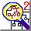

[DOCUMENTATION FOR CRI-MAP]{#RTFToC1} 
--------------------------------------

**VERSION 2.4 (3/26/90)**\
Phil Green, Kathy Falls, and Steve Crooks

------------------------------------------------------------------------

[INTRODUCTION]{#RTFToC4}
------------------------

The main purpose of **CRI-MAP** is to allow rapid, largely
automatedconstruction of multilocus linkage maps (and to facilitate the
attendanttasks of assessing support relative to alternative locus
orders, generatingLOD tables, and detecting data errors). Although
originally designed tohandle codominant loci (e.g. RFLPs) scored on
pedigrees \"without missingindividuals\", such as CEPH or nuclear
families, it can now (with somecaveats described below) be used on
general pedigrees, and some diseaseloci.

This version of **CRI-MAP** is distributed as source code in thelanguage
C, on a 360K DOS formatted diskette. To use it, you will needto obtain
access to a C compiler for your computer, and compile theprogram
yourself (see the section **Getting Started**, below). Thepresent
version of the program adheres fairly rigidly to the conventionsof
\"standard C\" as described in Kernighan and Ritchie (1978) (the
mainexception being that some variable and function names have more than
8significant characters), and should be compatible with most C
compilers.The program was developed and tested using vers. 2.0 and 2.3
of the VAXC compiler, on a Microvax II with 5 Mb memory under the
MicroVMS operatingsystem. It has been successfully ported to a number of
other computers,including other VAXes, SUN and Apollo workstations, and
the Mac II.

**CRI-MAP** requires a lot of memory; it is desirable to run it on
acomputer with at least 1 Mb (RAM or virtual memory) if you will be
analyzingmore than 10 loci simultaneously. It may be possible to run it
on an IBM ATunder DOS if your data set is small and you reduce the
default memoryallocations, although we have not tried this yet.

A small data set with several chromosome 7 markers is provided with
theprogram for the purpose of testing it (only). I would appreciate
beinginformed of any difficulties in implementing the program, bugs,
errors orgaps in the documentation, or suggestions for improvement.

**Historical note:** Version 1 of **CRI-MAP** was originally writtenby
me in the summer of 1986 in the language APL; the portion of thatversion
which does maximum likelihood estimation for a fixed locus orderwas
based on algorithms developed in collaboration with Eric Lander(Lander
and Green, 1987). Collaborative\'s chromosome 7 map (Barker*et al*.,
1987) was constructed using that version of **CRI-MAP**,running on an
IBM XT. In the summer of 1987 parts of the original versionwere
translated into C, with the help of Steve Crooks, and used
inconstructing the genome map published in **Cell** (Eric and his
groupat MIT independently constructed maps using the program
**MAPMAKER**).At this time I also discovered the \"layered EM\" maximum
likelihood searchmethod, described in (Green, 1988). In January, 1988, I
worked out a muchfaster algorithm for likelihood calculation (the method
of switch algebras\-- actually a family of related algorithms), also
described in (Green,1988). I have since written and tested the code for
these new algorithmsand incorporated them into version 2.0 of the
program; Kathy Falls hasworked on improving various other parts of the
program. Versionssubsequent to 2.3 were developed by me at Washington
University. I soonhope to incorporate a *full* likelihood analysis for
pedigrees withmissing individuals, and allow for disease loci with
incomplete penetrance.Any user feedback will be gratefully received, and
I will do my best toincorporate suggestions into future versions of the
program.

Phil Green\
Dept. of Genetics\
Box 8232\
Washington University School of Medicine\
St. Louis, MO 63110\

Tel: +1 314 362 5192\
FAX: +1 314 362 4137\

Email: <phg@u.washington.edu>\

------------------------------------------------------------------------

[Back to the Table of Contents](manuatoc.html)

------------------------------------------------------------------------

[Using CRI-MAP with general pedigrees and diseaseloci]{#RTFToC27}
-----------------------------------------------------------------

**CRI-MAP** can only handle disease loci to the extent that genotypes
areknown: this means that with autosomal dominant loci, affected
individuals areto be scored as heterozygotes at the disease locus, while
unaffecteds arescored either as homozygotes for the normal allele (if
you are willing toassume complete penetrance for that individual), or as
genotype missing(alleles both 0) otherwise. For recessive loci, only
affecteds and obligatecarriers should be scored for the disease locus.

With general pedigrees, **CRI-MAP** deduces missing genotypes
wherepossible, and computes a likelihood based only on analysis of the
known ordeduced genotypes. (Partial genotypes, i.e. those in which only
one allele isknown or deducible, are also utilized in the likelihood
calculation to theextent possible). This likelihood is the usual
likelihood (as defined forexample by Ott (1985)) when the pedigree data
are \"complete\" (i.e. genotypesare known or can be deduced at every
locus, for every individual havingdescendants in the pedigree).

If data are missing for an individual at a particular locus, and the
possiblegenotypes at that locus (i.e. those genotypes compatible with
the genotypes ofancestors and descendants) include a homozygous
genotype, then all meioses inthat individual are treated by **CRI-MAP**
as uninformative for that locus.A *full* likelihood analysis (as
provided for example by **LIPED** or**LINKAGE**) would instead consider
in turn each possible genotype at thelocus, assign relative
probabilities to each based on the genotypes ofancestors and
descendants, and compute a likelihood which is the weighted sumof the
likelihood expressions for each particular choice of
genotype.**CRI-MAP** thus ignores some of the available information. In
cases that wehave examined, however, the information loss appears to be
small.

If the missing locus genotype is in an \"original parent\" (i.e. an
individualwith no ancestors in the pedigree), then in a *full*
likelihood analysisthe population allele frequencies are used to assign
probabilities to variouspossible genotypes. These enter into the
likelihood by influencing theprobability that the allele in any child of
the original parent is derived fromthat parent. **CRI-MAP** does not
make use of allele frequencies; for anyallele in a child of an original
parent, **CRI-MAP** determines the parentalorigin when this can be
deduced from the other genotype information, butotherwise assigns equal
probability to the two possible parental origins forthe allele. In fact,
little information is lost by this procedure, except whenthe allele is
rare. For a rare dominant disease, if one parent is known to beaffected,
the other should therefore be scored as unaffected (rather than
asmissing, for example).

It should be noted in any case that the frequencies of RFLP alleles
haveusually been estimated in a different population (e.g. the CEPH
family parents)from the population from which the disease family is
drawn. It is ourexperience that allele frequencies may vary dramatically
between populations.Therefore it may be inappropriate to perform a
*full* likelihood analysisof disease linkage, if the results of that
study depend in an essential way onparameters estimated from another
population. A somewhat more limited analysiswhich makes no assumptions
concerning allele frequencies, such as that given by**CRI-MAP**, may be
preferable. If (for reasons of power) a *full*likelihood analysis is
necessary, that analysis should be performed using arange of allele
frequencies at each locus, in order to ensure that the resultsdo not
depend in an essential way on these frequencies.

Finally, it should be noted that whenever some available information
isarbitrarily excluded, as is the case with **CRI-MAP\'s** analysis of
generalpedigrees, there is a potential that artifactual biases in
parameter estimatescan be created. In a preliminary examination of this
possibility (cf. Goldgar*et al*, 1989), we have compared the results of
**CRI-MAP** with thoseof a *full* likelihood analysis program
(**LINKAGE**) for all pairs ofa set of 20 linked loci, in a data set
having 136 pedigrees, most with missingindividuals. The information loss
(as estimated by comparing the effectivenumber of informative meioses
for the two programs) averaged about 15%, and theestimated recombination
fractions were almost exactly the same. This suggeststhat bias is not
significant and information loss is small, at least in thisparticular
data set. However, the possibility of bias clearly needs to beconsidered
more thoroughly by means of simulation studies involving multipleloci,
and we are in the process of doing this. I would recommend that you
checkthe extent of information loss and/or possible bias in your data
set bycomparing the results of **CRI-MAP** to those of a *full*
likelihoodprogram for small sets of loci.

------------------------------------------------------------------------

[Back to the Table of Contents](manuatoc.html)

------------------------------------------------------------------------

[Getting Started]{#RTFToC28}
----------------------------

1\. Put all files on the diskette provided into a single directory on
yourcomputer.

2\. Compile the source code files (i.e. those whose names end in .c), and
linkthem together with your C stdio and math libraries, producing an
executablefile called **crimap**. There are slight differences in the
conventions usedby some C compilers which may make it necessary for you
to modify some of thesource files before they will compile correctly;
usually these will be evidentfrom the error messages generated by the
compiler. For example, if youroperating system is case-sensitive (e.g.
UNIX), you will need to rename allfiles in lower case (DOS converts all
file names to upper case). We havedeclared some stdio and math library
functions in the **crimap** functionswhere they are used; if your
compiler objects to this, you will need to deletethe offending
declarations.

**NOTE to VAX C users:** There is a bug in the optimizer of the VAX
Ccompiler, ver. 2.3 (and possibly in other versions), which causes it to
compilethe source file \"e\_conv.c\" incorrectly. When the program is
run, this willresult in an incorrectly created phase-known data
structure in the [.dat](#RTFToC32) file(see below). To avoid this,
compile e\_conv.c with the /NOOPTIMIZE option. Allother source files
should be compiled with the default /OPTIMIZE option.

Also see comments on \"underflow\" under **Technical Notes**.

3\. The command format for running the program is: **crimap**
{*chromosomenumber*} {*option*}

Example:

` crimap 7a twopoint`

The *option* name must be entered in lower case letters.
*Chromosome\"number\"* (which may consist of any string of digits,
possibly followed byletters \-- for example **7p**, or **17nf**, or
**0a**) may bereplaced by the name of the parameter file (described
below); for example:

` crimap chr7a.par twopoint`

You must provide a **[.gen](#RTFToC30)** file (named in accordance with
the conventionsdescribed below, and residing in the same directory as
**crimap**) whichcontains the raw genotype data, *and* run the
**[prepare](#RTFToC43)** *option*first in order to create the other
files required by the program.

All program output (apart from specific information written to one of
the fourfiles described in the next section) is displayed using the
\"printf\" functionin C. It will thus be displayed on the terminal
(unless redirected to a file bymeans of commands to the operating
system) if the program is run interactively,or written to a log file if
the program is run in batch mode. (The latterprocedure is the most
convenient way to make a copy of the output. In UNIX andsome other
operating systems, one can simply redirect the output to a file.)The
**[prepare](#RTFToC43)** and **[merge](#RTFToC42)** *options* are the
only ones requiringinteractive input.

4\. As a test run with the chromosome 7 data set, **chr7a.gen**,
providedwith the program, use the command:

` crimap 7a prepare`

to create a **[.dat](#RTFToC32)** file and a **[.par](#RTFToC31)** file
for subsequent useby the *option* **all**, with the loci 2 8 9 10.
(Specify any two ofthese as the \"ordered loci\", and the other two as
the \"inserted loci\".) Usedefault values for the other parameters.

**NOTE 1**: If the program stops prematurely, displaying the message
\"Yourcompiler uses a different size for integers; see documentation for
changes thatwill have to be made in the source code\", then you will
need to make certainminor modifications in the source files and
recompile. See \"16 bit integers\"under **Technical Notes**, below.

**NOTE 2**: If the program stops prematurely, displaying the message
\"Error:Allocation failed in morecore\", then the program\'s default
memory allocationsexceed what your operating system can provide. Reduce
the value of nb\_our\_allocin the **[.par](#RTFToC31)** file (using
**[prepare](#RTFToC43)**, or a text editor) and see\"Memory management\"
under **Technical Notes**, below.

Then run **CRI-MAP** with the command line:

` crimap 7a all`

The program prints out parameter values, tests all 12 possible orders of
these4 loci, and finally prints out a sorted list of all orders
whoselog10likelihood is at least that of the best order, less 3.0.

You should get the answer:

` 2 10 9 8 -97.937`

2 10 8 9 -100.839

The run to evaluate these 12 orders should take less than a minute
onmost workstations or moderately powerful personal computers (for
example, about50 secs on a Mac II, about 25 secs on a MICROVAX II
without a numericalcoprocessor, about 8 seconds on a SUN 3/60 or 2
seconds on a 4/60; exact timeswill depend on the efficiency of the C
compiler used as well as thecomputer).

------------------------------------------------------------------------

[Back to the Table of Contents](manuatoc.html)

------------------------------------------------------------------------

[File Structures]{#RTFToC29}
----------------------------

**CRI-MAP** uses four different types of files. These all have names of
theform **chr*x*.*y***, where ***x*** is the*chromosome \"number\"* and
the suffix **.*y*** is one of:

The user must supply the **[.gen](#RTFToC30)** file. The
**[.dat](#RTFToC32)** and **[.par](#RTFToC31)**files are created using
the *option* **prepare**, and must beconstructed before using any other
**CRI-MAP** *options* (except**[merge](#RTFToC42)**). The
**[.ord](#RTFToC33)** file is initialized by **[prepare](#RTFToC43)**,
butrequired only for the map building *options*
(**[build](#RTFToC36)**,**[instant](#RTFToC41)**, and
**[quick](#RTFToC44)**). You will need to learn about the structuresof
the **[.gen](#RTFToC30)** and **[.par](#RTFToC31)** files, but can
ignore the descriptions ofthe other file types if you wish.

Each file is in ASCII format, and can be edited with a text editor.
Forreadability, the user can insert additional blank or end of line
charactersinto these files if desired, since the C statements which read
the files treatany string of such characters as a single \"white space\"
delimiter between dataitems. All data items are either numbers or
character strings containing noblank spaces; they must be separated by
white space delimiters.

In the following descriptions, brackets {} are used to enclose data
itemsappearing in the file but *do not themselves appear in the file*.

### **[.gen file]{#RTFToC30}**

The data items in this file are as follows:

The pedigree structure must be completely specified; this means that for
anyindividual with an ancestor in the pedigree, both parents must be
assigned ID\#\'s and must appear in the file. The family ID may be any
string of characters(without embedded blanks) but individual IDs must be
numbers. For \"originalparents\" (individuals without ancestors in the
pedigree), the mother and fatherIDs are coded as 0. Alleles must be
represented by integers, with missingalleles scored as 0. To handle new
mutations in a dominant disease genecorrectly, ancestors of the mutant
individual should have their disease locusgenotypes coded as missing. To
handle non-pseudoautosomal X linked loci, adummy allele number (e.g. 9)
must be created and assigned as the second allelefor all males in the
pedigree.

[Example]{#RTFToCgenex}: For a data set
with two loci, LOCA and LOCB,scored on the single pedigree depicted on
the next page (*pedigree diagrammeunavailable - sorry!*), the
corresponding **.gen** file would be

`1`

2

LOCA LOCB

P100

6

1001 0 0 0

1 2 2 2

1002 1001 1009 0

1 2 1 2

1003 0 0 1

1 1 1 2

1004 1002 1003 0

1 2 1 1

1005 1002 1003 0

1 1 2 2

1009 0 0 1

0 0 0 0

**NOTE:** The missing maternal grandparent has been assigned an ID of
1009and included in the file.

### [.par file]{#RTFToC31}

This file may either be created using the **prepare** *option*,
ordirectly using a text editor. The format has been changed effective
withversion 2.4, and differs somewhat from that of the other files. Each
linecontains a parameter or variable name and its value(s) (separated by
spaces),and concludes with an asterisk \*. The parameters may appear in
any order withinthe file. If a parameter is omitted (either by omitting
the corresponding linealtogether, or by omitting the value between the
parameter name and theasterisk), then **CRI-MAP** will automatically
assign a default value to theparameter.

In the following descriptions, each line ending in an asterisk is
displayed asit would appear in the **.par** file, and gives a parameter
name togetherwith its default value(s) (if any). Any number of hap\_sys,
hap\_sys0, andfixed\_dist lines may appear in the file. The other
parameters should appearonly once. (If they appear more than once, only
the last specified value willbe used).

`dat_file chrx.dat *`

gen\_file chr*x*.gen \*

ord\_file chr*x*.ord \*

These give the names of the **[.dat](#RTFToC32)**,
**[.gen](#RTFToC30)**, and **[.ord](#RTFToC33)** files tobe used in the
analysis. When the name of the **.par** file is *not* ofthe form
chr*x*.par, the default names for the above files are obtained
byreplacing the \".par\" (which must always appear) in the name of the
**.par**file with \".dat\", \".gen\", or \".ord\", respectively. (This
is sometimes useful ifone wants to keep all files in a separate
directory from the program itself, inwhich case the name of the **.par**
file passed to **crimap** may includethe full path name; the default
names for the other files will then include thesame path).

`nb_our_alloc 3000000 *`

The initial memory allocation (in bytes). The default value will suffice
formost runs, except with a very large number of loci, and in fact is
much morethan is usually needed for analyzing a small number of loci. If
additionalmemory is needed during the run, it will be allocated
automatically (up to thelimits of your system); however it is
advantageous to choose values for theinitial allocation which will
suffice for the entire run. See \"Memorymanagement\" under **Technical
Notes**.

`SEX_EQ 1 *`

SEX\_EQ is 1 if recombination rates are assumed equal in the two sexes,
0 ifsex-specific rates are to be allowed in each interval.

`TOL .01 *`

The tolerance for determining convergence of the layered EM algorithm;
whenlog10likelihoods from successive \"phase unknown\" iterations
increase by lessthan this amount, iteration terminates. The tolerance is
used to detectconvergence in the \"non**-** informative locus\" part of
layered EM, and inthe *option* **twopoint** is TOL/10. In extensive
tests using our RFLPCEPH family data sets (several hundred maximum
likelihood estimations) thedefault value .01 was always found to be
adequate (it was occasionally notadequate when ordinary EM was used as
the search method, instead of layeredEM). If you are concerned about the
possibility that this may not be stringentenough for for your data set
(for example, if the likelihood surface isrelatively flat), try using
.001 instead; the linear nature of EM convergenceguarantees that, if the
estimates had not converged with TOL = .01, then asubstantial
improvement in likelihood should be apparent with the morestringent
tolerance. If such an improvement is seen, use successively
smallervalues for TOL until no further improvement in the likelihood
results.

`PUK_NUM_ORDS_TOL 6 *`

Applies only to the *option* **[build](#RTFToC36)**; gives the maximum
number oforders allowed in the current map, in the phase unknown part of
the analysis.

`PK_NUM_ORDS_TOL 8 *`

Similar to PUK\_NUM\_ORDS\_TOL, but applies instead to the phase known
analysis in**[build](#RTFToC36)**. If 0, the phase known analysis will
be skipped entirely duringmapbuilding.

`PUK_LIKE_TOL 3.0 *`

The tolerance for discarding locus orders. If the log10likelihood of an
orderis less than the log10likelihood of some other order for the same
loci by anamount exceeding PUK\_LIKE\_TOL, that order is discarded (or
not printed). Usedby mapbuilding *options*, **[all](#RTFToC35)** and
**[flips*n*](#RTFToC39)**. With**[twopoint](#RTFToC45)**, LOD tables are
displayed only for locus pairs whose LODexceeds PUK\_LIKE\_TOL.

`PK_LIKE_TOL 3.0 *`

As above, but applies only to analysis of the phase known data in
the*option* **[build](#RTFToC36)** (and is not used by the other
*options*).

`use_ord_file 0 *`

This parameter applies only to the *options* **[all](#RTFToC35)**
and**[flips*n*](#RTFToC39)**. When it is 1, the orders generated by
those*options* are prescreened against the **[.ord](#RTFToC33)** file to
eliminate ordersincompatible with the orders database, prior to
computing likelihoods. Whenuse\_ord\_file is 0, the information in the
orders database is not used.

`write_ord_file 1 *`

Applies only to the *option* **[build](#RTFToC36)**. When it is 1, the
results ofthe current **[build](#RTFToC36)** run are used to update the
orders database. When it is0, the orders database will not be updated
(but will still be used to prescreenorders during the course of the
run).

`ordered_loci {index# of 1st ordered locus} {index# of 2d ordered locus}. . .*`

 

`inserted_loci {index# of 1st inserted locus} {index# of 2d inserted locus}. . .*`

**NOTE:** locus indices start at 0.

For all *options* except **[twopoint](#RTFToC45)**, the
\"ordered\_loci\" are assumedto be in their known, unique order; the
remaining loci, called the\"inserted\_loci\", are to be placed in the
framework defined by the ordered loci.For the *options*
**[chrompic](#RTFToC37)**, **[fixed](#RTFToC38)**, and
**[flips*n*](#RTFToC39)**,there are no inserted loci. For
**[twopoint](#RTFToC45)**, if both ordered\_loci andinserted\_loci are
specified, then LOD tables are only computed for pairs ofloci for which
one is in the ordered list and the other is in the insertedlist.
Otherwise the analysis uses all pairs of loci in the specified
list(ordered or inserted).

`hap_sys {index# of 1st locus in system} {index# of 2d locus} . . . *`

 

hap\_sys0 {index\# of 1st locus in system} {index\# of 2d locus} . . .\*

[]{#parhap_sys}

Each haplotyped system is a list of loci (for example, different RFLPs
detectedby the same probe) which are to be grouped together in an
analysis. The firstlocus in any system is called \"primary\", and the
remaining loci are called\"secondary\". When the parameter use\_haps
(see below) is 1, the secondary lociin a system \"tag along\" with the
primary locus whenever ordered sets of lociare constructed. The
operations which construct new orders (for example, byinserting a new
locus into the map, or by permuting a collection of loci)utilize only
the primary loci; once the order is constructed, however, it is\"filled
out\" by inserting secondary loci immediately following thecorresponding
primary locus, prior to calculating likelihoods and mapdistances.
Secondary loci are automatically deleted from the input lists ofordered
loci and inserted loci. Thus any system which is to be included in
theanalysis must be represented by (at least) its primary locus.

For systems specified using hap\_sys, the loci within a system are
treated asindependent in all calculations; i.e. they are not forced to
have 0recombination fraction. In particular, intralocus recombinants
between loci inthe same system are permitted. For systems specified
using hap\_sys0, distanceswithin the system are forced to 0 (the program
will stop, displaying themessage \"Error: 0 likelihood\", if there are
in fact intralocus recombinants).

Example: two haplotyped systems, the first having loci 3, 4, and 5
withdistances not forced to 0.0, and the second having loci 9 and 11
with distancesforced to 0.0, would be entered in the **.par** file as

`hap_sys 3 4 5 *`

hap\_sys0 9 11 \*

 

`use_haps 1 *`

When use\_haps is set to 1, haplotyping is performed; when it is 0,
anyhaplotyped systems specified in the **.par** file are ignored (i.e.
theinput lists of loci are taken as is, and no secondary loci are
deleted orinserted).

`fixed_dist {rec. frac.} {index# of 1st locus} {index# of 2d locus} {sex(optional)} *`

For the *options* **fixed** and **[chrompic](#RTFToC37)** (only),
therecombination fraction between a pair of adjacent loci may be held
fixed usingfixed\_dist. If the recombination fraction to be fixed is
sex-specific, specifythe sex as 0 for female, or 1 for male. If either
locus is part of a haplotypedsystem, it must be the primary locus from
its system (it is not possible toforce a distance within a haplotyped
system, except by using hap\_sys0 asdescribed above).

**NOTE:** Any recombination fractions held fixed, either using
fixed\_dist orhap\_sys0, are flagged by an asterisk in the map displayed
following theanalysis.

The last line of the **.par** file must contain the single word

`END`

 

Example: if you wished to construct a **.par** file**chr7a.par** to
perform the all analysis described in **GettingStarted**, above, the
following three lines would suffice (since defaultvalues are to be used
for all other parameters):

`ordered_loci 2 8 *`

inserted\_loci 9 10 \*

END

### [.dat file]{#RTFToC32}

This file, which is created by the program (using the
**prepare***option*), not the user, has two data structures, each having
thefollowing data items:

The first such data structure has the \"phase known\" data: there is 1
\"family\"with all the chromosomes in the data set, and 0 switches. All
loci of unknownphase are given phase X, as are loci on the chromosomes
of children ofidentical heterozygotes (the latter restriction is
necessary to avoid bias inthe estimation of recombination fractions, cf.
Ott (1985)). The second datastructure contains the full phase
information for the data set, arranged byfamilies. (For definitions of
switches and phase chromosomes, see (Green,1988)).

The \"phase known\" data structure is used only by the
*option***[build](#RTFToC36)**.

### [.ord file]{#RTFToC33}

(For definition of terminology, see description of the
**[build](#RTFToC36)***option*, below.)

------------------------------------------------------------------------

[Program options]{#RTFToC34}
----------------------------

### [all]{#RTFToC35}

Finds log10likelihoods for all locus orders which result from placing
theinserted loci in all possible positions with respect to the ordered
loci (seedescription of the **[.par](#RTFToC31)** file, above, for
definition of these terms). Theprogram finds the order with the highest
log10likelihood, **L**, and printsout, in decreasing order of
log10likelihood, those orders whose associatedlog10likelihoods are
greater than or equal to (**L** - PUK\_LIKE\_TOL).In particular, when
the number of ordered loci is two, all possible orders ofthe specified
loci are analyzed. When using this *option*, keep in mindthat the number
of orders analyzed is n!/f!, where n is the total number ofloci and f is
the number of ordered loci (and ! denotes factorial), and thatanalysis
of all 360 orders of a typical set of 6 loci on chromosome 7 takesabout
30 mins on a MICROVAX II; thus it is probably impractical to use
this*option* with more than 6 inserted loci, except on a much faster
computer.When use\_ord\_file is set to 1 in the **[.par](#RTFToC31)**
file, any orders incompatiblewith the orders database are eliminated
prior to calculating likelihoods, whichmay make it feasible to use
**[all](#RTFToC35)** with larger sets of loci.

One convenient use of this *option* is to position a new locus
(whichwould be specified as the single inserted locus) with respect to a
set of lociof known order.

### [build]{#RTFToC36}

Builds a map by sequential incorporation of loci. This is the
main*option* used for RFLP map construction.

To describe the method used in greater detail, define an \"orders
object\" to bea collection of loci, together with a set of permissible
orders for those loci.The \"orders database\" contains a collection of
orders objects. At any givenstage during the map construction \"the
map\" (designated \"current\_orders\" in theprogram source code, and
output) consists of one such orders object. At thebeginning of the run
the orders database is empty, and the map consists of the\"ordered
loci\" specified in the **[.par](#RTFToC31)** file. (In the absence of
any priorinformation concerning locus order, such as physical
localization data, oneusually chooses the \"ordered loci\" to be a pair
of linked and highlyinformative loci, in order to accelerate the map
construction process). Thefirst locus in the list of inserted loci
(specified in the **[.par](#RTFToC31)** file) isplaced in each possible
interval in the map. The resulting locus orders arethen tested for
compatibility with the database; each order not excluded issubjected to
a full maximum likelihood estimation. The order having the
highestlog10likelihood is found, and any order whose log10likelihood is
less than thisone by more than a specified tolerance (PUK\_LIKE\_TOL or
PK\_LIKE\_TOL) iseliminated. The resulting collection of non-excluded
orders form an ordersobject (called \"orders\_temp\" in the program
output). The database is thenupdated by (1) appending orders\_temp to
it; and (2) for each orders objectalready in the database, eliminating
any order which is incompatible withorders\_temp. If orders\_temp has
fewer, or the same number, of orders as doesthe map, then it becomes the
new map and the added locus is deleted from thelist of inserted loci.
Otherwise the next locus in the list is tried in thesame manner. If no
locus in the list meets this criterion, the one with thesmallest
orders\_temp is added to the map. Each time a locus is added to themap,
the program returns to the beginning of the (revised) list of
insertedloci. The orders database is kept in memory during the program
run; a copy ofit is written to the **[.ord](#RTFToC33)** file every time
a new locus is added to themap, so that the program can be stopped and
restarted later without loss of theinformation in the database.

**Build** first analyzes the \"phase known\" data (see description
of**[.dat](#RTFToC32)** file structure), for which maximum likelihood
computation is muchmore rapid than for the full data set. When the map
gets too large (i.e. thenumber of orders in the map exceeds
PK\_NUM\_ORDS\_TOL), **build** proceeds tofind a set of uniquely ordered
loci, starting with the original ordered lociand adding additional loci
which now have a unique placement (during thislatter step, the program
only makes use of information in the data base; itperforms no likelihood
calculations). Using this uniquely ordered set of locias the new
\"map\", the program then proceeds to analyze the full data set,
againadding loci sequentially according to the procedure described
above. Thisportion of the program stops when the number of orders in the
map exceedsPUK\_NUM\_ORDS\_TOL. **Build** then again extracts a set of
uniquely orderedloci on the basis of information in the orders database,
and prints outsex-specific and sex-averaged recombination fractions and
the correspondingKosambi centiMorgans for these loci. For each remaining
locus, it prints outthe possible placements with respect to the uniquely
ordered loci, along withthe log10likelihoods for each placement.

If one starts the map with a pair of unlinked loci, then construction of
themap is slower, because in the initial stages the map will consist of
twounlinked linkage groups which can be in either orientation with
respect to eachother so that there are more orders to keep track of (and
to place remainingloci in). Conversely, if the initial loci are at 0
recombination fraction (forexample, two RFLPs detected by the same
probe), then in all subsequent maps theloci will appear in both possible
orientations, thereby doubling the number oforders. What is worse, the
parts of the program which extract the maximum setof uniquely ordered
loci will never get past these two (since no other locus isuniquely
placed with respect to them). To avoid this, it is advisable to putthese
loci later in the list, or (better) to haplotype them using hap\_sys
orhap\_sys0 in the **[.par](#RTFToC31)** file.

It is a good idea to exclude relatively uninformative loci from the
initial mapconstruction process: they tend to have multiple possible
placements, resultingin a large number of orders to test. Their
positions can be determined laterusing **[all](#RTFToC35)**, or
**[instant](#RTFToC41)**.

With large numbers of loci, it may be necessary to perform several map
runsusing **build** until one arrives at \"the best\" set of uniquely
orderedloci. Information in the orders database is cumulative between
runs, providedit is not reinitialized using **[prepare](#RTFToC43)**; it
is not necessary toreinitialize the orders file when using different
sets of loci from the samefile.

**NOTE:** The goal of multilocus linkage analysis is to find the locus
orderhaving the highest likelihood, and identify alternative orders with
comparablelikelihoods. Because it is impossible to consider all possible
orders for alarge set of loci, it is necessary to adopt a strategy which
makes decisions onthe basis of subsets of the loci. Multiple statistical
tests are performed,each with a nonzero probability for Type I error.
Because incorrect orders willsometimes have significantly higher
likelihoods than the correct one, and thechance of this happening
increases with the number of sets of loci which areexamined during the
map construction process, it is possible that the maximumlikelihood
order would in fact be rejected by **build** (or any otherpublished
method for map construction, for that matter) because for some*subset*
of the loci, an alternative order has a significantly higherlikelihood.
In our experience this happens only very rarely (probably becausethe
tests are not independent), and when it does is usually due to errors
inthe data itself. Nevertheless, three precautions should be taken to
guardagainst the possibility of an erroneous order being adopted by
**build**.First, we usually construct initial maps using a fairly
stringent tolerance forrejecting orders \-- PUK\_LIKE\_TOL at least 3.0
\-- and then lower it to 2.0 (andomit the phase known part of the
analysis) for construction of the final map.Second, it is advisable to
check the final order by running**[flips*n*](#RTFToC39)** to look at
permutations of successive triples orquadruples of loci. Finally, it is
a good idea to construct the map severaldifferent times, using different
starting pairs of loci and a differentsequence for adding the loci each
time.

### [chrompic]{#RTFToC37}

Displays the grandparental origins of alleles in each child\'s
chromosomes, forthe phase choice having the highest likelihood; gives
the relative probabilityfor this phase choice and for the next most
likely alternative; gives thenumber and location of recombinations on
each chromosome, and provides, foreach chromosome interval defined by
the loci, a list of the chromosomes havinga recombination in that
interval. Flags candidate data errors.

For this *option*, the program begins by finding maximum
likelihoodestimates of the recombination fractions (for the specified
locus order); theseare then used to find, for each pedigree in the data
set, the particular phasechoice having the highest likelihood for that
pedigree. (The algorithm used forthis purpose is described in (Green,
1988)). For each individual with parentsin the pedigree, the chromosomes
are displayed (maternal first, then paternal).(The individual\'s ID \#
appears to the left of the maternal chromosome.) A \'0\'(resp. \'1\')
means the allele is of known phase and is of grandmaternal
(resp.grandpaternal) origin. For alleles of unknown phase, \'o\' and
\'i\' are usedinstead, denoting the grandparental origin in the most
likely phase choice. \'-\'means that the locus is noninformative.

To the right of the chromosome appears the number of recombinations.
Beneaththe chromosome appear the names of any informative loci which are
out of phasewith the nearest informative loci on either side; when the
loci are closelyspaced, these are candidate data errors.

Following the chromosome pictures for all the families is a list of
recombinantchromosomes. For each pair of loci, the chromosomes are
listed in which thereis a recombination between those two loci (and no
intervening locus isinformative). The recombinant chromosomes are
designated by family number,individual ID \#, and M or P (for maternal
or paternal).

Following the list of recombinant chromosomes is a list of groups of
loci notseparated by any crossovers in the data set; and finally, the
maximumlikelihood recombination fractions which were used in computing
probabilitiesof the phase choices.

### [fixed]{#RTFToC38}

For a set of loci in a specified order, finds the associated maximum
likelihoodrecombination fractions and map distances and the
correspondinglog10likelihood. The recombination fraction between any
pair of adjacent locimay be held fixed by using fixed\_dist in the
**[.par](#RTFToC31)** file.

### [flips]{#RTFToC39}*n*

For each locus order obtained by permuting an *n*-tuple (*n* \>= 2)of
adjacent loci within an initial (reference) locus order, displays
therelative log10likelihood (i.e. the log10likelihood of the reference
order,minus that of the permuted order). For example, **flips3** will
findrelative log10likelihoods for all permutations involving triples of
adjacentloci. (If *n* is omitted it is assumed to be 2). When *n* is
2,relative log10likelihoods for all permutations are displayed; for
higher valuesof *n*, only the permutations whose log10likelihoods are at
least that ofthe original order, less PUK\_LIKE\_TOL, are displayed.

**NOTE:** the total \# of orders which must be evaluated is

`(m - n + 1)(n! - (n-1)!) + (n - 1)!`

where m is the total \# of loci; thus it is impractical to use
this*option* with large values of n. However, when use\_ord\_file is set
to 1 inthe **[.par](#RTFToC31)** file, permutations incompatible with
the orders database areeliminated before calculating likelihoods, which
will sometimes make itfeasible to use larger n\'s.

### [instant]{#RTFToC41}

Finds a uniquely ordered set of loci, and the possible placements of
theremaining loci with respect to them, using only the information
alreadyexisting in the **[.ord](#RTFToC33)** file (the
**[.ord](#RTFToC33)** file must have been createdin a previous
**[build](#RTFToC36)** run). Log10likelihoods for the different
placementsof the non-uniquely ordered loci are computed.

### [merge]{#RTFToC42}

Merges two **[.gen](#RTFToC30)** files, having overlapping sets of
families and/or loci.The *option* is run interactively: in response to
prompts, the user entersthe names of the two files to be merged, and the
name for the merged outputfile. File names must be complete (i.e. the
**[.gen](#RTFToC30)** suffix needs to beincluded). The program compares
family IDs and locus names in the two inputfiles, and for families
having the same ID compares individual ID \#s; it thenmerges the data
from the two files into a single **[.gen](#RTFToC30)** file,
takingoverlaps into account. A family appearing in both files need not
have exactlythe same individuals (in which case the output file will
have a merged familywith all individuals appearing in either input
file); the program checksindividuals which do occur in both input files
to make sure their mother andfather ID \#s and sex agree, and if they
don\'t displays an error message. If thetwo files have some loci in
common, the genotypes at those loci in the outputfile for an individual
appearing in both input files will be those from thesecond file.

**NOTE 1:** Although the command format for using this *option* is
thesame as for the other *options*, the chromosome number is
ignored(although it must appear), and no **[.par](#RTFToC31)** file is
needed.

**NOTE 2:** Be careful when merging files containing, say, CEPH and
diseasefamilies that there are no spurious matches between family IDs.
For thispurpose it is useful to use the fact that family IDs may be
arbitrary characterstrings; so for example CEPH family IDs may be
prefixed with \"CEPH\".

### [prepare]{#RTFToC43}

This *option* (which is run interactively) must be run before any of
theother *options*, to create the **[.dat](#RTFToC32)** and
**[.ord](#RTFToC33)** files used bythem. It will also create a
**[.par](#RTFToC31)** file (or modify an existing one),however once you
are familiar with the format of the **[.par](#RTFToC31)** file you
willprobably find it quicker to create and modify that file with a text
editor,rather than use **[prepare](#RTFToC43)** repeatedly.

Example of usage:

` crimap 7a prepare`

**[prepare](#RTFToC43)** first searches for the **[.gen](#RTFToC30)**
and **[.dat](#RTFToC32)** files of thecorrect name (in the above
example, **chr7a.gen** and **chr7a.dat**). Ifthere is no
**[.dat](#RTFToC32)** file, one is created from the
**[.gen](#RTFToC30)** file; if bothexist, the program asks whether a new
**[.dat](#RTFToC32)** file should be created fromthe
**[.gen](#RTFToC30)** file (select this *option* if the
**[.gen](#RTFToC30)** file is morerecent). If neither exists, a message
to that effect is given and the programterminates. As the
**[.dat](#RTFToC32)** file is being created, family IDs are displayedand
any non-inheritances are noted. (These should be checked carefully:
amissing data item in the **[.gen](#RTFToC30)** file will generally
result in multiplenon-inheritances and incorrect family IDs for the
subsequent families. If non-inheritances are found, these should be
corrected in the **[.gen](#RTFToC30)** file, and**[prepare](#RTFToC43)**
run again).

**[prepare](#RTFToC43)** then displays values for several parameter
values, includingwhether to compute sex-averaged or sex-specific
likelihoods, and toleranceswhich control convergence of the maximum
likelihood search and the map buildingprocess (see description of
**[.par](#RTFToC31)** file, above). The displayed values arethe defaults
(given in the description of the **[.par](#RTFToC31)** file) or the
valuesspecified in any pre-existing .**par** file of the same name. The
user isthen prompted to change any of these values, if desired.

Any haplotyped systems, or fixed distances (see description of
**[.par](#RTFToC31)**file) in a pre-existing **[.par](#RTFToC31)** file
are then displayed, and you areprompted to enter any new ones if
desired. (**[prepare](#RTFToC43)** cannot be used tomodify or delete
systems in the pre-existing file; you must use a text editorfor this).

**[prepare](#RTFToC43)** then displays the names of the other
**CRI-MAP***options*, and asks which one it should set up the
**[.par](#RTFToC31)** file for.Depending on the option chosen, the user
is now prompted to specify the indicesof the \"ordered loci\", and of
the \"inserted loci\". The ordered loci aregenerally fixed in that order
during subsequent analysis, while the insertedloci are tried in all
possible positions. When nothing is to be assumed aboutlocus order only
two ordered loci should be specified. (**[twopoint](#RTFToC45)** is
aspecial case; see its description below).

For the map-building *options* (**[build](#RTFToC36)**,
**[instant](#RTFToC41)**, and**[quick](#RTFToC44)**), the ordered loci
form the initial map. As the default (in thiscase only), if requested,
**[prepare](#RTFToC43)** will sort the loci by informativenessof the
phase known data and designate the two most informative loci as
theordered loci, and the remaining loci as inserted. For the
*options***[fixed](#RTFToC38)**, **[flips*n*](#RTFToC39)**, and
**[chrompic](#RTFToC37)**, all loci are specifiedas ordered, and none
are inserted. See the description of the **[.par](#RTFToC31)** file,or
the relevant *option*, for further details.

If the *option* **[build](#RTFToC36)** has been specified,
**[prepare](#RTFToC43)**initializes an orders file, unless one already
exists, in which case it askswhether the existing one should be used.

Finally, **[prepare](#RTFToC43)** asks whether to create a new
**[.par](#RTFToC31)** filecontaining the information you have input. You
have the option at this point ofaborting the creation of a new file, in
which case any preexisting **[.par](#RTFToC31)**file will remain intact.

### [quick]{#RTFToC44}

Similar to **[instant](#RTFToC41)**, except that log10likelihoods
are*not* computed.

### [twopoint]{#RTFToC45}

Performs **[twopoint](#RTFToC45)** linkage analysis for each pair of
loci. In the case ofsex specific analyses, the output for each pair
appears on three lines: thefirst has the locus names, followed by the
maximum likelihood estimates, f andm, of the female and male
recombination fractions, and the sex-specific LODS (= log10like(f,m)
**-** log10like(.5,.5)). The second line has the values oflog10like(r,m)
**-** log10like(.5,.5) for r = .001, .01, .05, and allmultiples of .05
up through .5. The last line similarly has the values oflog10like(f,r)
**-** log10like(.5,.5). Only pairs for which the LODS
exceedPUK\_LIKE\_TOL are printed out. (You can get tables for all pairs
by settingPUK\_LIKE\_TOL = 0.0).

When SEX\_EQ is 1, the sex-averaged recombination fractions, LODS,
andlog10likelihoods are given instead.

Haplotyped systems may be used for either locus in a pair. If the loci
within asystem are not forced to have 0 distance, then maximum
likelihood intralocusdistances are found simultaneously with the maximum
likelihood interlocusdistances, and are subsequently held fixed at these
values when likelihoods arecalculated at the above specified interlocus
distances.

If both ordered\_loci and inserted\_loci are specifed in the
**[.par](#RTFToC31)** file,tables are only computed for pairs consisting
of one locus from each list. Thisis convenient, for example, when one
has just added data for a new set of locito a file and wishes to look
for linkages with the old loci. If only one list(either ordered\_loci or
inserted\_loci) is non-empty, LOD tables are computedfor all pairs of
loci within that list.

------------------------------------------------------------------------

[Back to the Table of Contents](manuatoc.html)

------------------------------------------------------------------------

[Technical Notes]{#RTFToC46}
----------------------------

Memory management

Memory is allocated dynamically by the program, as needed; however,
sincerepeated requests of memory from the operating system (via the C
stdio libraryfunction malloc) are quite time-consuming, we have adopted
a strategyin which two large initial blocks of memory are first
allocated. One of theseis reserved for the objects comprising the orders
database and is apportionedout as needed by the function
our\_orders\_alloc, while the other is used for allother memory
requirements and is apportioned by our\_alloc. If the amountsinitially
allocated are insufficient, additional memory is requested from
theoperating system (via the library function malloc). (When this
happens, astatement to that effect is printed). The default initial
request of 3Mb (forour\_alloc) will suffice for nearly all runs. If the
program requests morememory than the operating system can provide, the
program terminates with themessage
\"`Error: Allocation failed in morecore`\". if this happens, trysetting
the amount of memory specified in the **[.par](#RTFToC31)** file (using
theparameter nb\_our\_alloc) to the maximum amount the operating system
will allowyou (and see if your system manager can increase that amount
by adjustingoperating system parameters). If that fails, you may need to
reduce the numberof loci being analyzed (often, deletion of a single
locus having a large numberof switches may suffice), or to split a large
pedigree into subpedigrees. I wouldbe interested to learn of cases where
that is necessary, since it may bepossible to improve the switch algebra
algorithm to avoid it.

Underflow

When mapping large numbers of loci, the individual family likelihoods
involveproducts of many factors numerically less than 1, and so can
become quitesmall. If possible, at compilation time you should select an
option forrepresentation of floating point numbers which allows them to
be as small aspossible. With VAX C, this is done by using the /g\_float
option with thecompile command cc, and then linking with the vaxcrtlg
library.

16 bit integers

C compilers usually represent integer variables with either 16 or 32
bits. Thesource code provided to you assumes that you have a \"32 bit\"
compiler. If, whenyou first try to run the program, it terminates
prematurely, displaying themessage
\"`Your compiler uses a different size for integers; see documentationfor changes that will have to be made in the source code`\",
then you have a 16bit compiler. To get the program to run correctly you
must then make thefollowing two changes in the source code and
recompile:

\(1) in the file \"`defs.h`\", replace the line

\(2) Consult the manual for your compiler and determine the name of a
librarymemory allocation function which takes long integers, instead of
integers, asarguments (the function malloc takes integer arguments). The
name of thisfunction will be something like \"mlalloc\" (Lightspeed C)
or \"\_halloc\"(Microsoft C, ver 4.0 or later). Whatever it is,
substitute it for \"malloc\"throughout the source files our\_allo.c and
our\_orde.c. If your compiler doesnot have such a function, you will be
unable to run **CRI-MAP**.

------------------------------------------------------------------------

[Back to the Table of Contents](manuatoc.html)

------------------------------------------------------------------------

[Changes incorporated in Versions 2.2 - 2.4]{#RTFToC47}
-------------------------------------------------------

The main change in Version 2.2 is the incorporation of a more efficient
\"switchalgebra\" algorithm which in many cases (particularly for large
pedigrees)substantially reduces memory requirements and running time.
Thus for many runs,even with a relatively large number of loci, the
default memory request of 3 MB(for nb\_our\_alloc in the
**[.par](#RTFToC31)** file) is overly generous.

Version 2.3 incorporates a better switch algebra algorithm which
furtherreduces memory and running time. Additional changes have been
made which shouldmake this version compatible with most C compilers.

Version 2.4 incorporates the following changes:

\(1) Haplotyping: It is now possible to constrain the loci in a
haplotypedsystem to be at 0 distance from each other for all likelihood
calculations. Inaddition, haplotyping can be used with all of the
*options*; inparticular, **[twopoint](#RTFToC45)** LOD tables can be
generated for pairs of haplotypedsystems. Haplotyped systems are now
specified in the **[.par](#RTFToC31)** file (andthere is no longer a
**.hap** file).

\(2) Fixed distances: It is now possible to fix the distance between a
pair ofadjacent loci, for the purpose of likelihood calculations, with
the*options* **[fixed](#RTFToC38)** and **[chrompic](#RTFToC37)**.

\(3) The **[.ord](#RTFToC33)** file can optionally be used: i) to
pre-screen locus ordersgenerated by **[all](#RTFToC35)** and
**[flips*n*](#RTFToC39)**, or ii) to reduce the numberof orders for
which likelihoods need be calculated. (Previously the
**[.ord](#RTFToC33)**file was only used by the mapbuilding *options*).
The parameteruse\_ord\_file in the **[.par](#RTFToC31)** file controls
the use of the **[.ord](#RTFToC33)** filewith these *options*.

\(4) **[twopoint](#RTFToC45)**: It is now possible to divide the loci
into two differentgroups, and generate LOD tables only for pairs
consisting of one locus fromeach group (this makes it possible, for
example, to conveniently generate LODtables between \"new\" loci and
\"old\" loci). The parameter PUK\_LIKE\_TOL is nowused as a LOD cutoff:
tables are displayed only for locus pairs whose LODexceeds
PUK\_LIKE\_TOL.

\(5) **[chrompic](#RTFToC37)**: Chromosomes are now labelled by
individual ID \# (notposition within **[.gen](#RTFToC30)** file); phase
designations are now always consistentacross pedigrees (not merely
across chromosomes) even in the phase unknowncase; the relative
probabilities for the best phase choice and the next mostlikely
alternative are given; the phase designations now distinguish phaseknown
from phase unknown.

\(6) a new *option*, **[merge](#RTFToC42)**, makes it easy to merge two
**[.gen](#RTFToC30)**files having overlapping sets of families and/or
loci.

Other changes in Version 2.4, include: family IDs are now allowed to
bearbitrary character strings (not merely integers as in previous
versions); theformat of the **[.par](#RTFToC31)** file has been changed
to make it easier to use; theorders displayed by **[all](#RTFToC35)**
are sorted by decreasing log10likelihood; outputof
**[flips*n*](#RTFToC39)** is easier to read (the \"flipped\" loci in
each order arehighlighted).

------------------------------------------------------------------------

[Back to the Table of Contents](manuatoc.html)

------------------------------------------------------------------------

[BIBLIOGRAPHY]{#RTFToC48}
-------------------------

> Barker D, Green P, Knowlton R, Schumm J, Lander E, Oliphant A,Willard
> H, Akots G, Brown V, Gravius T, Helms C, Nelson C, Parker C, Rediker
> K,Watt D, Weiffenbach B, Donis-Keller H (1987): Genetic linkage map of
> humanchromosome 7 with 63 DNA markers. *Proc. Natl. Acad. Sci. USA*
> **84**:8006-8010.

> Donis-Keller H, Green P, Helms C, Cartinhour S, Weiffenbach B,Stephens
> K, Keith T, Bowden D, Smith D, Lander E, Botstein D, Akots G,
> RedikerK, Gravius T, Brown V, Rising M, Parker C, Powers J, Watt D,
> Kauffman E,Bricker A, Phipps P, Muller-Kahle H, Fulton T, Ng S, Schumm
> J, Braman J,Knowlton R, Barker D, Crooks S, Lincoln S, Daly M,
> Abrahamson J (1987): Agenetic linkage map of the human genome. *Cell*
> **51**:319-337.

> Goldgar D, Green P, Parry D, Mulvihill J (1989): Multipoint
> linkageanalysis in Neurofibromatosis Type I: An international
> collaboration. *Am JHuman Genetics* **44**: 6-12.

> Green P (1988): Rapid construction of multilocus genetic linkagemaps.
> I. Maximum likelihood estimation. (draft manuscript).

> Kernighan B, Ritchie D (1978): *The C programming
> language*.Prentice-Hall.

> Lander E, Green P (1987): Construction of multilocus geneticlinkage
> maps in humans. *Proc. Natl. Acad. Sci. USA* **84**:2363-2367.

> Ott J (1985): *Analysis of human genetic linkage*. JohnsHopkins
> University Press.

------------------------------------------------------------------------

Document formatting for the World Wide Web courtesy of **EMBnet
Education andTraining Programme Committee**, and with permission from
the author.

------------------------------------------------------------------------

**CRI-MAP tutorial** contents:

 

[Manuals:\
Web & text\
versions](crimanua.html)

[Web Manual\
Table of\
Contents](manuatoc.html)

[ Tutorial \
 Practice \
 Datasets ](datasets.html)

[Formating\
data with\
\"`prepare`\"](datafrmt.html)

[Mapping\
with\
\"`build`\"](analyse1.html)

[Testing &\
Extending\
Maps](analyse2.html)

[Bibliography\
&\
Other Links](biblinks.html)

------------------------------------------------------------------------

  

------------------------------------------------------------------------

[**Comments? Questions? Accolades?**]{#comments}\
*Please* talk to your teacher  **( )**

------------------------------------------------------------------------

Updated on Wednesday, 22 January, 2005\
HTML Version Copyright
